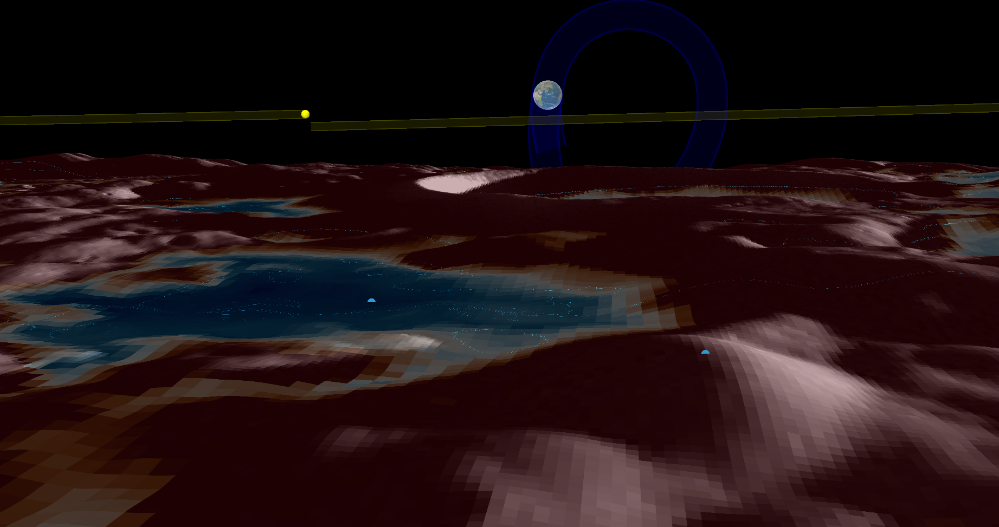
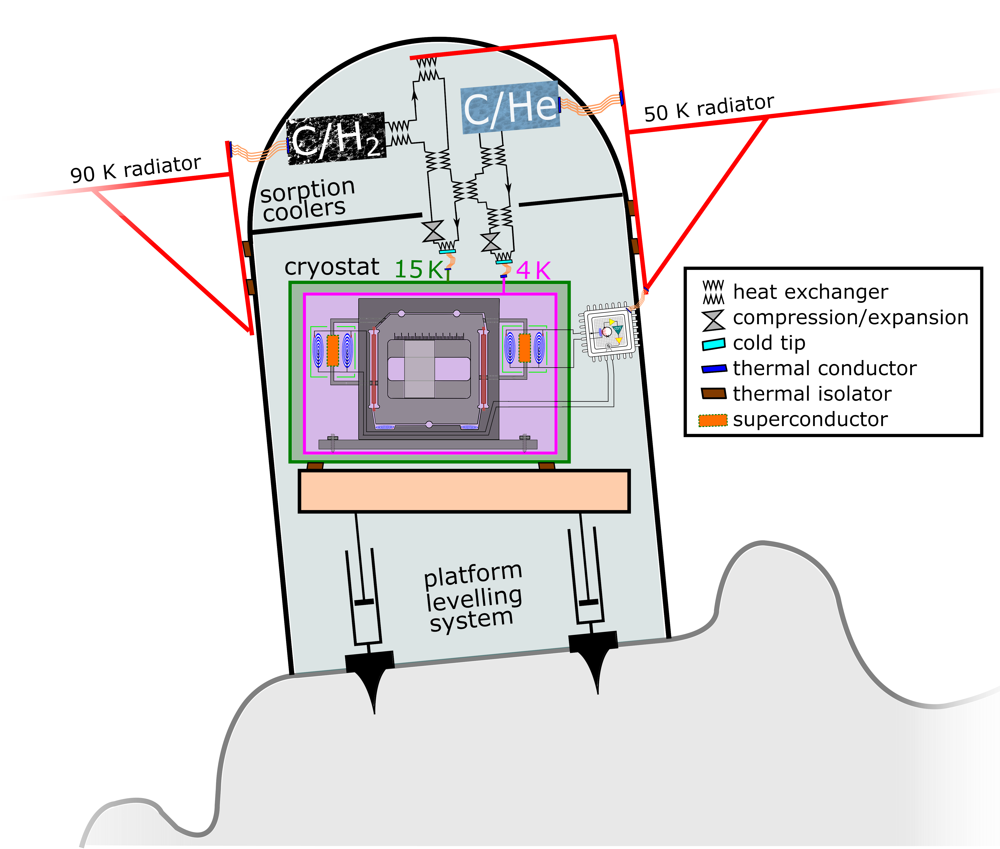
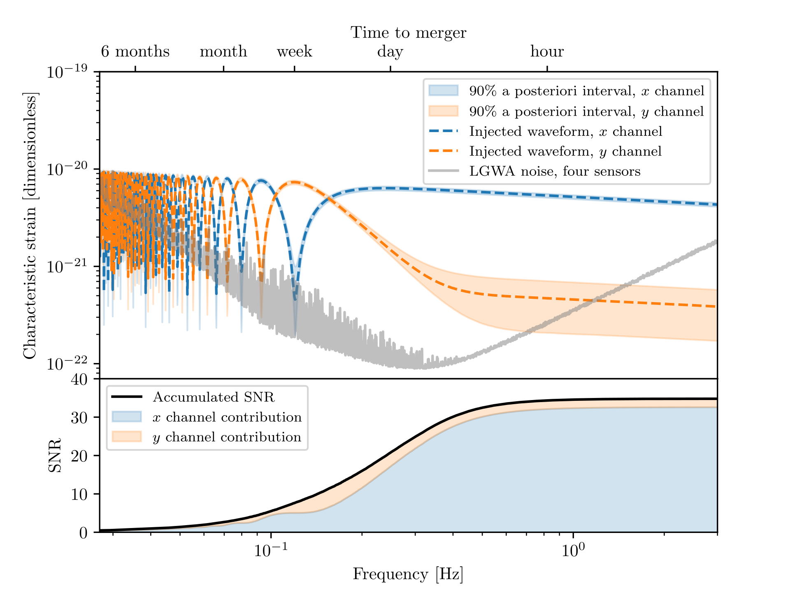
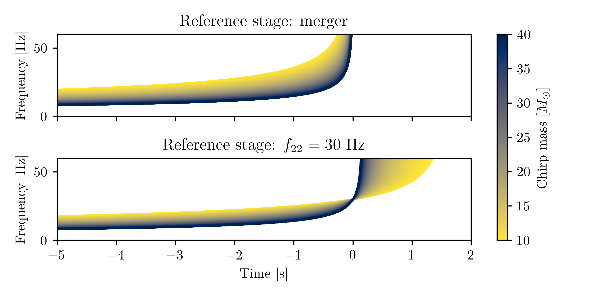
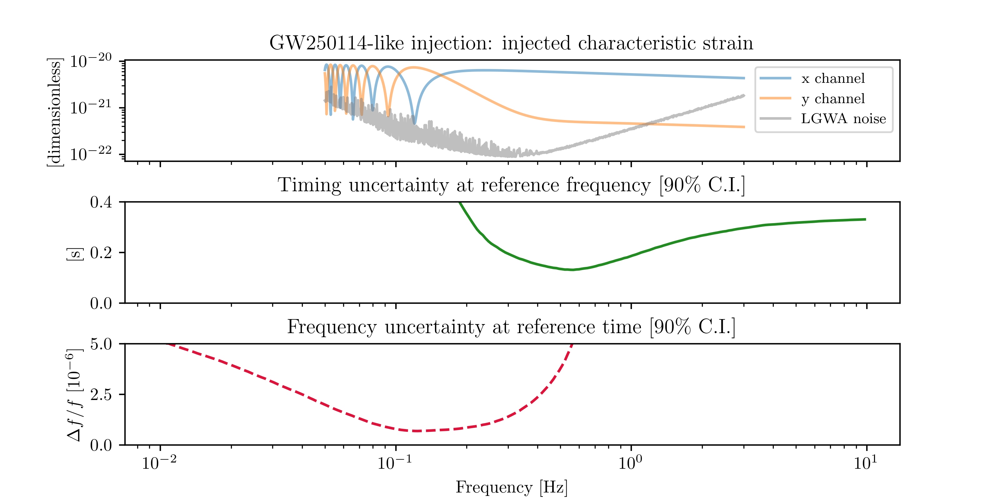
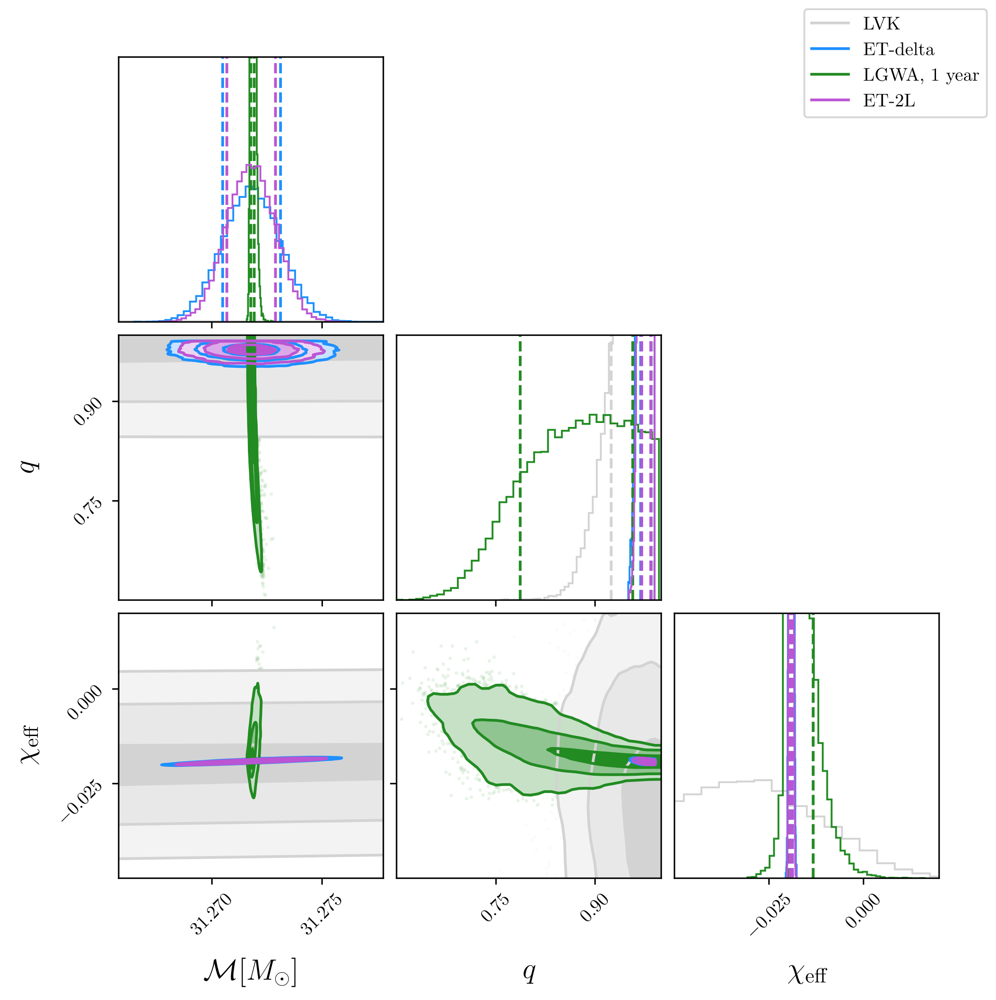
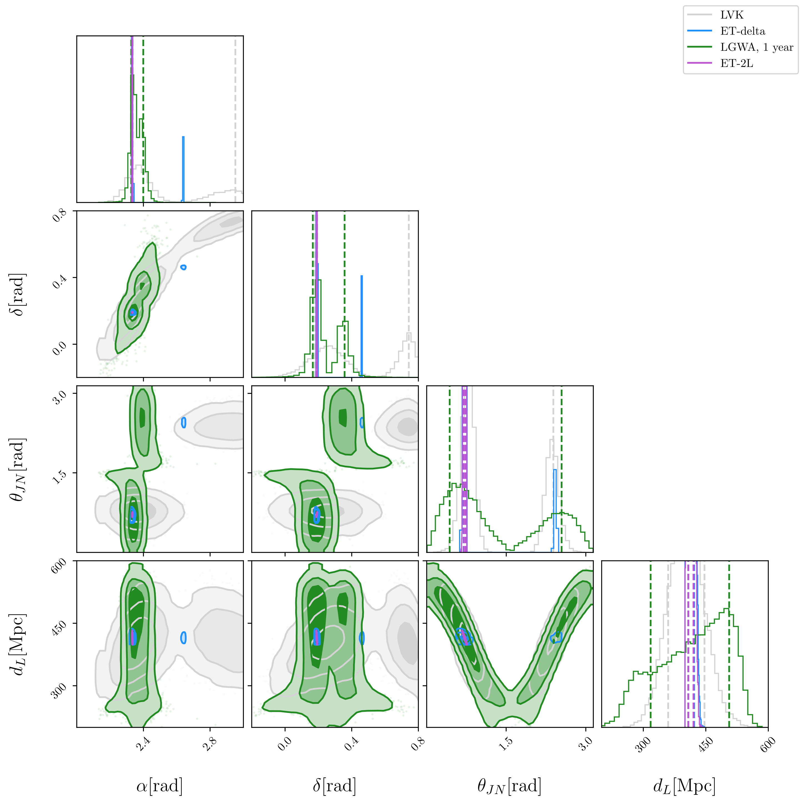

# Lunar Gravitational Wave Antenna 

## The lunar north pole

## Detector configuration

:::: {layout="[ 40, 60 ]"}

::: {#first-column}

Measuring seismic motion at 4 locations inside a lunar crater,
with cryogenics and seismic noise cancellation.

::::: {style="font-size: 70%;"}

[@vanheijningenPayloadLunarGravitationalwave2023]
:::::

:::

::: {#second-column}

{width=70%}
:::
::::

## GW250114 with the LGWA

{width=75%}

## What to use as a timing reference

:::: {layout="[ 40, 60 ]"}

::: {#first-column}

The merger time is out of band!

Instead, we can use $t_{22}(f)$; the optimum is for $f\approx 0.56$ Hz.

:::

::: {#second-column}

{width=80%}
{width=80%}

:::
::::

## Where to measure time

From merger time samples at a location $r_0$,
we obtain samples of time measured at a frequency $f$ and location $r$ by:

$$
t_{i}^{f, r} = t_{i}^{\text{mrg}, r_0} 
- \frac{(r-r_0 ) \cdot \hat{n}_{i}}{c}
+ \frac{1}{2 \pi} \frac{ \text{d} \varphi_{22}(f; \theta_i)}{ \text{d} f}
$$

At any given frequency $f$ we can compute 

$$r_{\text{min}}(f) = \text{argmin}_r \text{var}(t_i^{f, r})
$$

## Minimum motion in 3D



## Effect on sampling time

::::: {style="font-size: 80%;"}

|   Likelihood evaluations |   Sampling time [min] |   Timing uncertainty [s] |   Prior width [s] | Sampler   | Center   |
|-------------------------:|----------------------:|-------------------------:|------------------:|:----------|:---------|
|                    91515 |                   3   |                    0.075 |               0.5 | `nessai`  | optimal  |
|                   107878 |                   3.6 |                    0.075 |              27   | `nessai`  | optimal  |
|                   659816 |                  16.7 |                    4.733 |              27   | `nessai`  | SSB      |
|                   806067 |                  16.8 |                    0.074 |               0.5 | `dynesty` | optimal  |
|                  1530906 |                  33   |                    0.076 |              27   | `dynesty` | optimal  |
|                  9144813 |                 198.6 |                    4.766 |              27   | `dynesty` | SSB      |

:::::

# Einstein Telescope comparison

---

:::: {layout="[ 40, 60 ]"}

::: {#first-column}

Intrinsic parameters:

- extremely precise on $\mathcal{M}$;
- complementary with ET;
- more precise than LVK on effective spin.

::::: {style="font-size: 70%;"}

[@tissinoGeometryLunarGravitational2026]
:::::

:::

::: {#second-column}

{width=80%}
:::

::::

---

:::: {layout="[ 40, 60 ]"}

::: {#first-column}

Extrinsic parameters:

- LGWA localization tighter and "rounder" than LVK;
- inclination not well constrained by LGWA;
- ET-2L: tight, near Gaussian.
- ET-$\Delta$: tight, bimodal.

::::: {style="font-size: 70%;"}

[@tissinoGeometryLunarGravitational2026]
:::::

:::

::: {#second-column}

{width=80%}
:::

::::

## Massive BBH: multimodalities

:::: {layout="[ 40, 60 ]"}

::: {#first-column}
Sky localization modes for high mass 

($150 M_{\odot} \lesssim \mathcal{M} \leq 1100 M_{\odot}$)

and distant ($D_L \gtrsim 6 \text{Gpc}$) BBH.

::::: {style="font-size: 70%;"}

[@santoliquidoComparingNextgenerationDetector2026]
:::::

:::

::: {#second-column}
{width=60% }
:::

::::

## Massive BBH: sky posterior

![[@santoliquidoFastAccurateParameter2025].](figures/5_skymap_252_geocent_ET-1.png){width=80%} 

## GW250114: arrival times at the vertices 

 

## GW250114: multimodality

- SNR: 682 for ET-$\Delta$, 835 for ET-2L, 35 for LGWA;
- 6 sky modes excluded by the arrival time discrepancy;
- ~5% of the posterior mass in a mode with 
    - $\beta = - \beta_{\text{inj}}$, 
    - $\theta_{JN} = \pi - \theta_{JN}^{\text{inj}}$,
    - $\psi = \pi - \psi^{\text{inj}}$.
    - $t_{\text{geo}} = t_{\text{geo}}^{\text{inj}} - 2 \vec{r}_{\text{ET}} \cdot \hat{k}_{\text{inj}} / c$.

## References