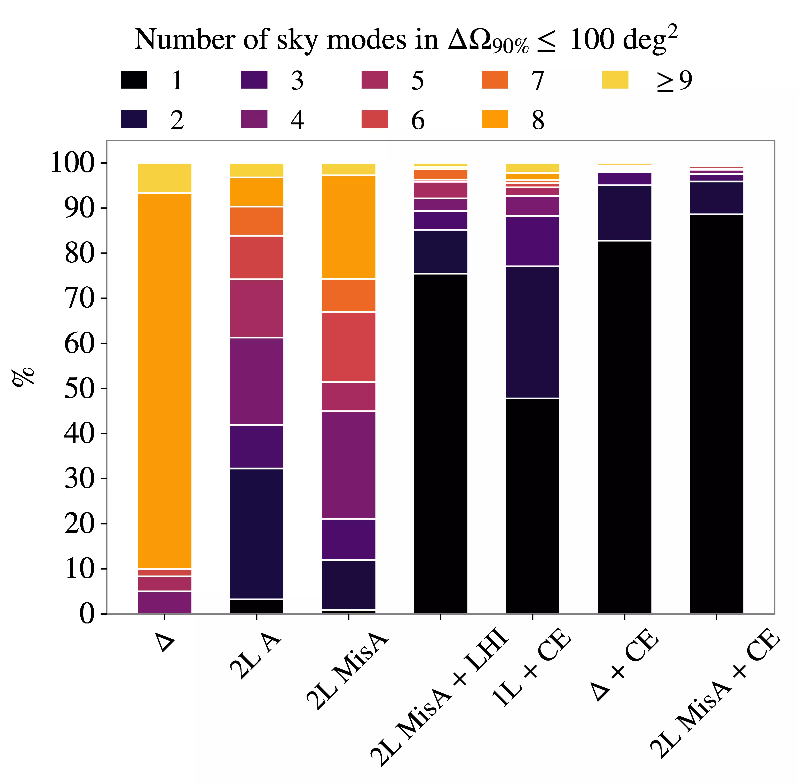
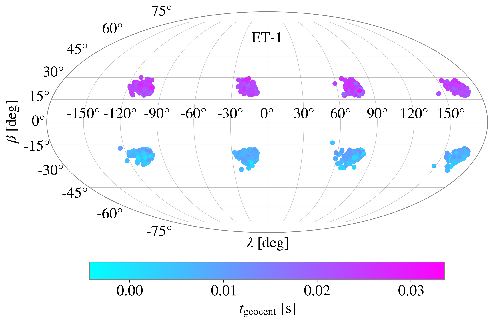
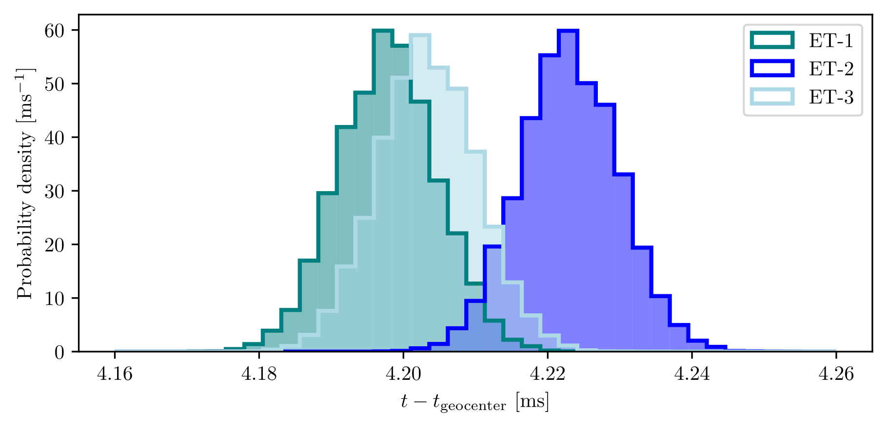

## The 

[ET docs link to the paper.](https://apps.et-gw.eu/tds/?r=20361)

## Shifting timing

From merger time samples at a location $r_0$, written as $t_{i}^{\text{mrg}, r_0}$,
we obtain samples of time measured at a frequency $f$ and location $r$ by:

$$
t_{i}^{f, r} = t_{i}^{\text{mrg}, r_0} 
- \frac{(r-r_0 ) \cdot \hat{n}_{i}}{c}
+ \frac{1}{2 \pi} \frac{ \text{d} \varphi_{22}(f; \theta_i)}{ \text{d} f}
$$

## Minimum motion in 3D



# Einstein Telescope injections

## Multimodalities

:::: {layout="[ 40, 60 ]"}

::: {#first-column}
Sky localization modes for high mass 

($150 M_{\odot} \lesssim \mathcal{M} \leq 1100 M_{\odot}$)

and distant ($D_L \gtrsim 6 \text{Gpc}$) BBH.

::::: {style="font-size: 70%;"}

[@santoliquidoComparingNextgenerationDetector2025]
:::::

:::

::: {#second-column}
{width=60% }
:::

::::

## Octimodal sky distribution

 

## Arrival times at the vertices

 

## References